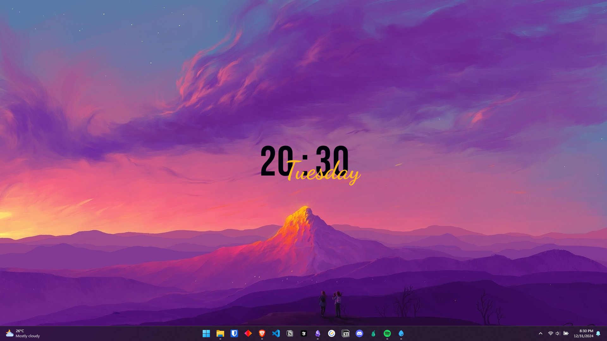
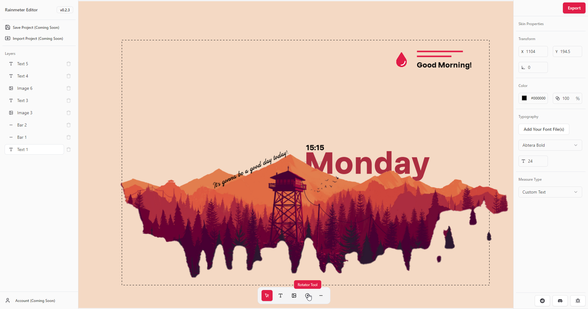

# Rainmeter Editor

[](LICENSE)
[](https://github.com/kethakav/rainmeter-editor/releases)

A modern, open-source GUI editor for [Rainmeter](https://www.rainmeter.net/) skins. Design, preview, and export Rainmeter skins visually—no INI editing required!

> **Note:** Rainmeter Editor and Rainmeter itself are **Windows-only**. This app will not run on macOS or Linux.

---

## Features

- **Visual Skin Editor:** Drag-and-drop interface for creating and arranging layers (text, images, bars, rotators, etc.)
- **Layer Management:** Reorder, select, and delete layers with a sidebar and drag-and-drop support
- **Property Editing:** Sidebars for editing properties of each layer type (text, image, rotator, bar, etc.)
- **Font & Image Management:** Use local fonts and images, which are bundled with your exported skin
- **Rainmeter Export:** Export your design as a Rainmeter-compatible `.ini` skin, with all assets and correct folder structure
- **Native Windows Integration:**
  - File dialogs for opening/saving
  - Auto-update via GitHub Releases
  - Fast, lightweight Tauri backend
- **Community:** Discord and Reddit for support, feedback, and sharing

---

## Quick Start (Development)

1. **Install Prerequisites:**
   - [Node.js](https://nodejs.org/)
   - [Rust](https://www.rust-lang.org/tools/install)
   - [npm](https://www.npmjs.com/) or [pnpm](https://pnpm.io/)

2. **Clone the Repository:**
   ```sh
   git clone https://github.com/kethakav/rainmeter-editor.git
   cd rainmeter-editor
   ```

3. **Install Dependencies:**
   ```sh
   npm install
   # or
   pnpm install
   ```

4. **Run the App:**
   ```sh
   npm run tauri dev
   ```
   The app will open in a native window. You can now start designing Rainmeter skins!

---

## Download and Install (Windows)

To get the latest version of Rainmeter Editor, visit the [official website](https://rainmetereditor.pages.dev/) and download the Windows setup file.

Alternatively, you can also find releases on the [GitHub Releases](https://github.com/kethakav/rainmeter-editor/releases) page.

### Installation Instructions

1. Download the latest release from the [official website](https://rainmetereditor.pages.dev/) or [GitHub Releases](https://github.com/kethakav/rainmeter-editor/releases).
2. Run the downloaded setup file.
3. **Important:** Windows SmartScreen may display a warning indicating that the app is from an unverified developer. To proceed with the installation:
   - Click on "More info".
   - Click on "Run anyway".

---

## Usage

- Use the toolbar to add text, images, bars, and rotators to your canvas.
- Arrange and configure layers using the sidebars.
- Export your skin via the Export button; the app will generate a Rainmeter-compatible folder with all assets and an `.ini` file.
- Import/export project support is coming soon.

---

## Community & Support

- [Discord](https://discord.gg/tzY82KkS4H) — Get support, share your creations, and connect with other Rainmeter enthusiasts
- [Reddit](https://www.reddit.com/r/rainmetereditor/) — Share and discuss skins and features
- [Report a Bug](https://github.com/kethakav/rainmeter-editor/issues/new?template=bug_report.yml)
- [Request a Feature](https://github.com/kethakav/rainmeter-editor/issues/new?template=feature_request.yml)

---

## Contributing

See [CONTRIBUTING.md](CONTRIBUTING.md) for guidelines. All contributions, bug reports, and feature requests are welcome!

---

## Security

See [SECURITY.md](SECURITY.md) for reporting vulnerabilities.

---

## License

MIT License (see [LICENSE](LICENSE))

---

## Screenshots & Videos

#### YouTube Tutorial (Click on the image)
[](https://youtu.be/FxBZCdO-a5o)  
#### Screenshots


---

## Acknowledgements

- Built with [Tauri](https://tauri.app/), [React](https://react.dev/), [Fabric.js](http://fabricjs.com/), [Radix UI](https://www.radix-ui.com/), and [Tailwind CSS](https://tailwindcss.com/).